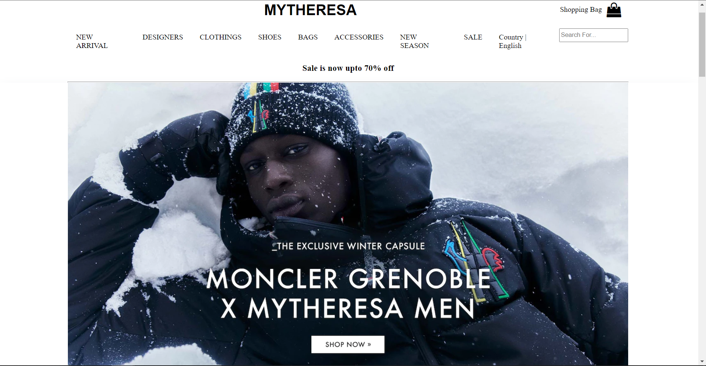
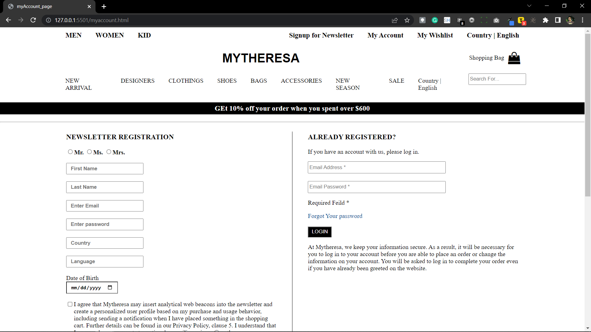
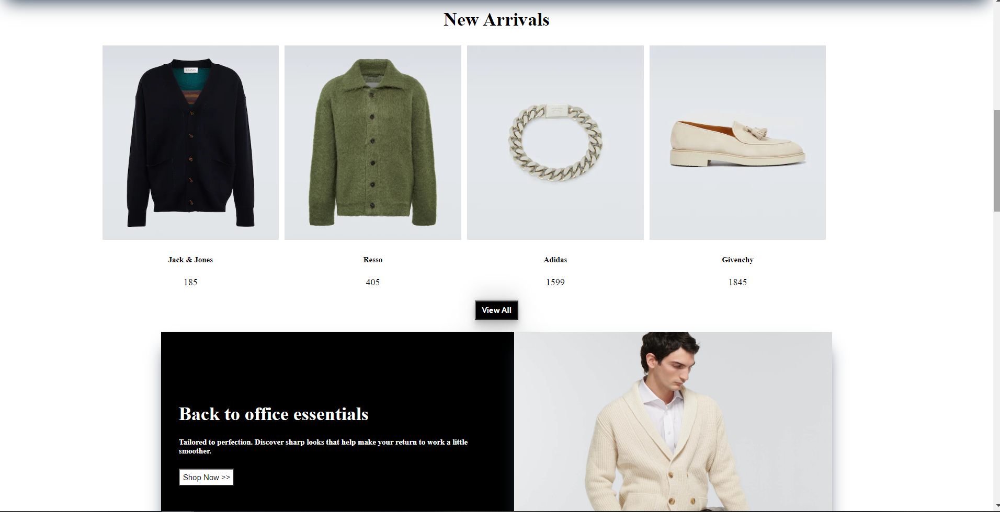
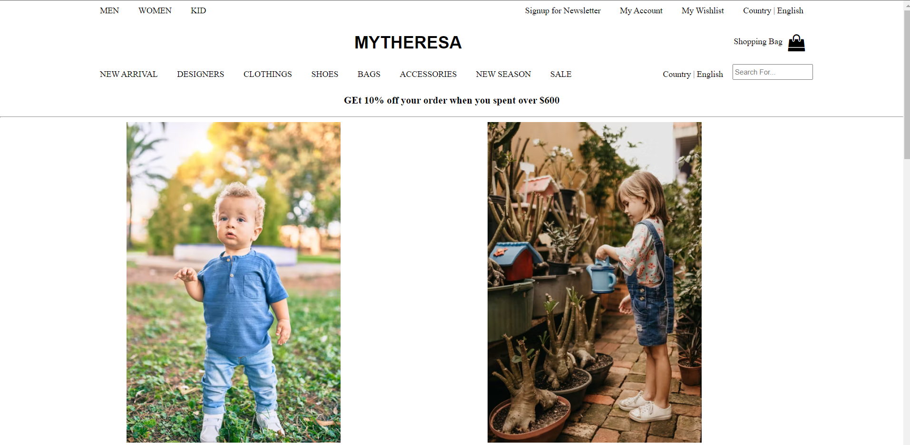
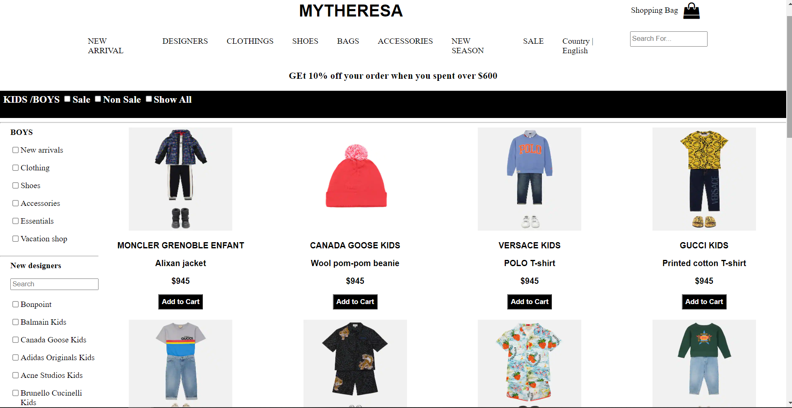
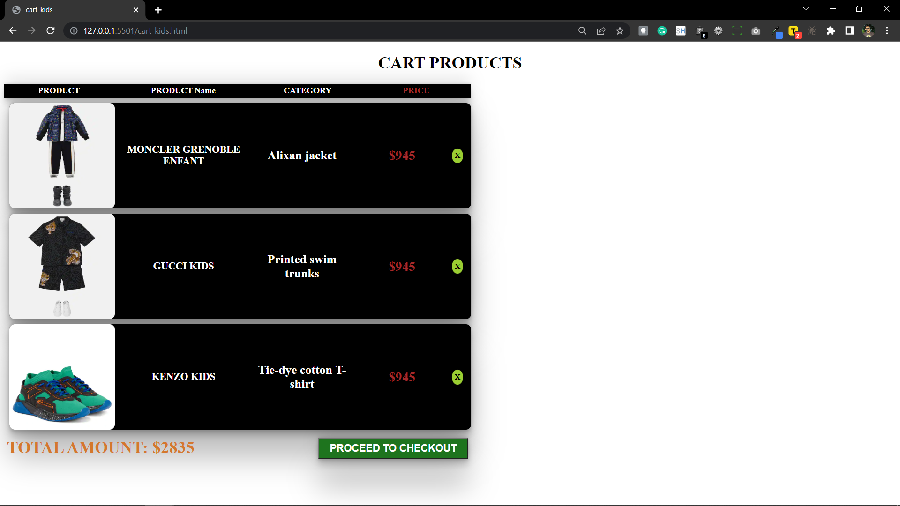

# mytheresa.com clone

Mytheresa is an online shopping destination for children, men and women's luxury clothing, bags, shoes, and accessories.

AS part of unit 3 construct week i cloned the frontend of Mytheresa to the best of my ability as individual in the span of 5 days.

[Deploy link](https://chic-mooncake-91e805.netlify.app/)

## Tech Stack:

   
   
   
   

## Features:

1.Social Sign-up/Sign-in. 2. basic User authentication with Local Storage. 3. Local Storage to manage user data . 4. Add to cart. 5. Delete products from cart. 6. payment forms for valid users

<h1>Snapshots of our project</h1>

1. This is the Landing page of mytheresa.com

2.This is Sign-up and Sign-in Page

3.This is new arrival product on landing Page

4.This is kids categogy page

5.This is shuffle product page

6.This is cart with added items page

7.This is Payment page

<!-- 

1. This is the basket.

5.Checkout Page

6.Payment Confirm

7.Otp Page

 -->

We all individually did the task but not completed it on that date which I decided earlier or partially completed. It happens because we neglect the less important parts such as some CSS to the page. But the website is not completed until you match all the items so we have to consider all parts and give them equal importance to each one.
Second thing is that we neglect media queries at first and think that we will complete them later. But in last we struggled so much to change the website. We also have to consider CSS grid properties even when there is no chance to apply them. We have to find a way to apply it. Otherwise, we will face huge problems.
